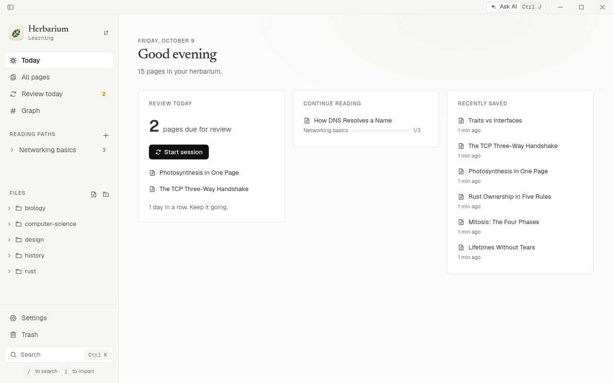
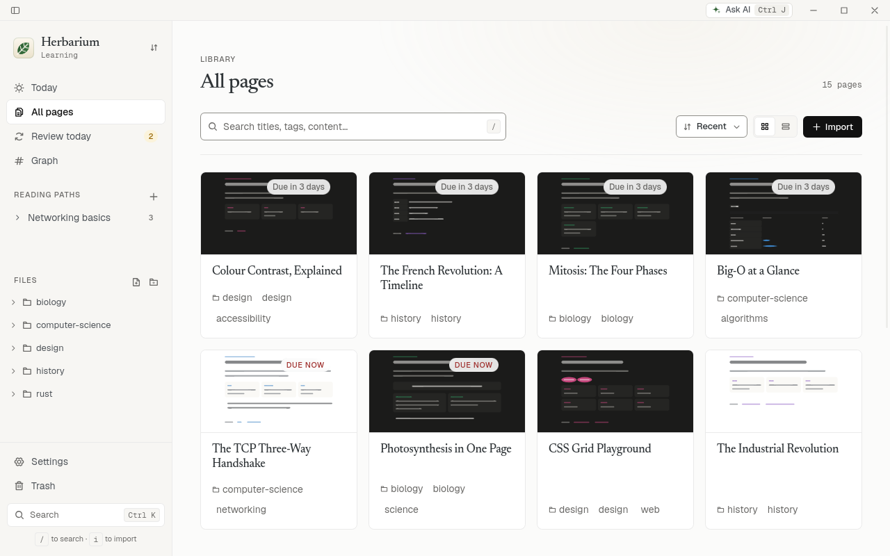
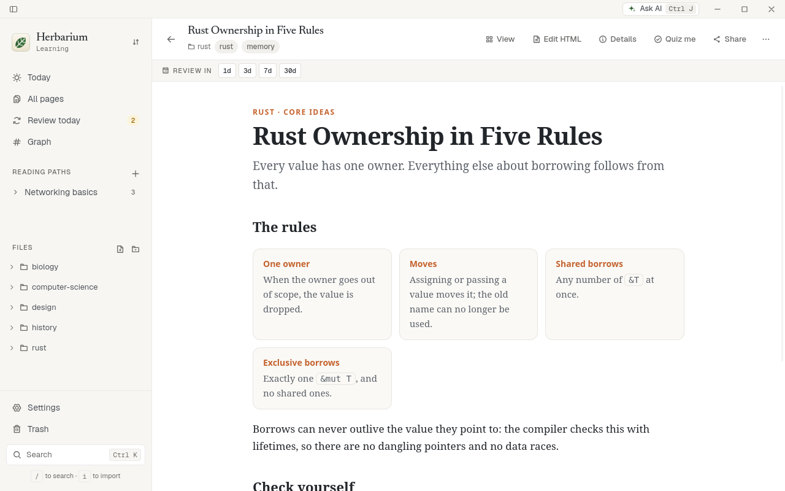
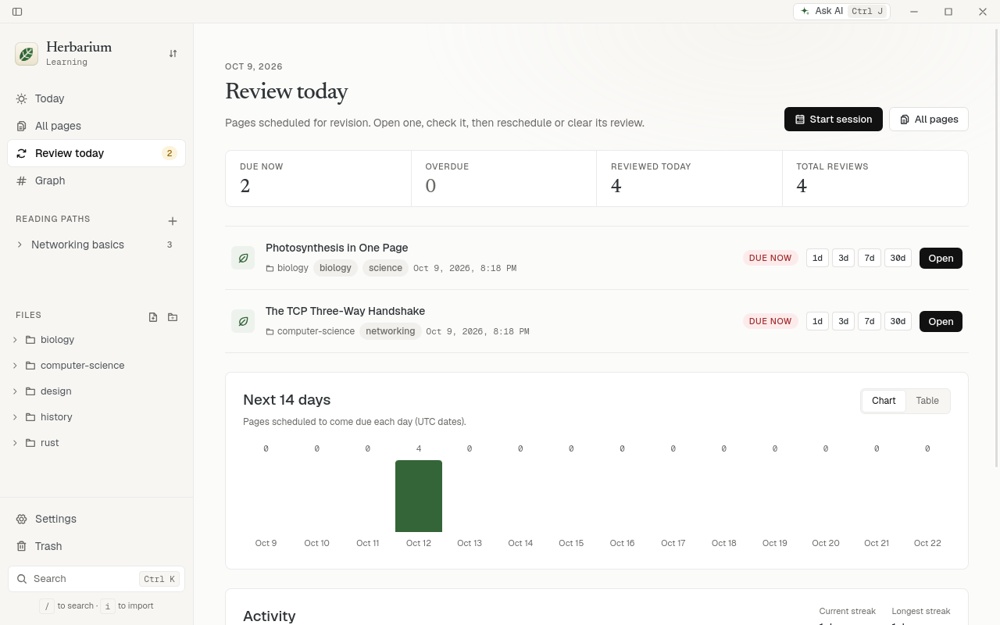
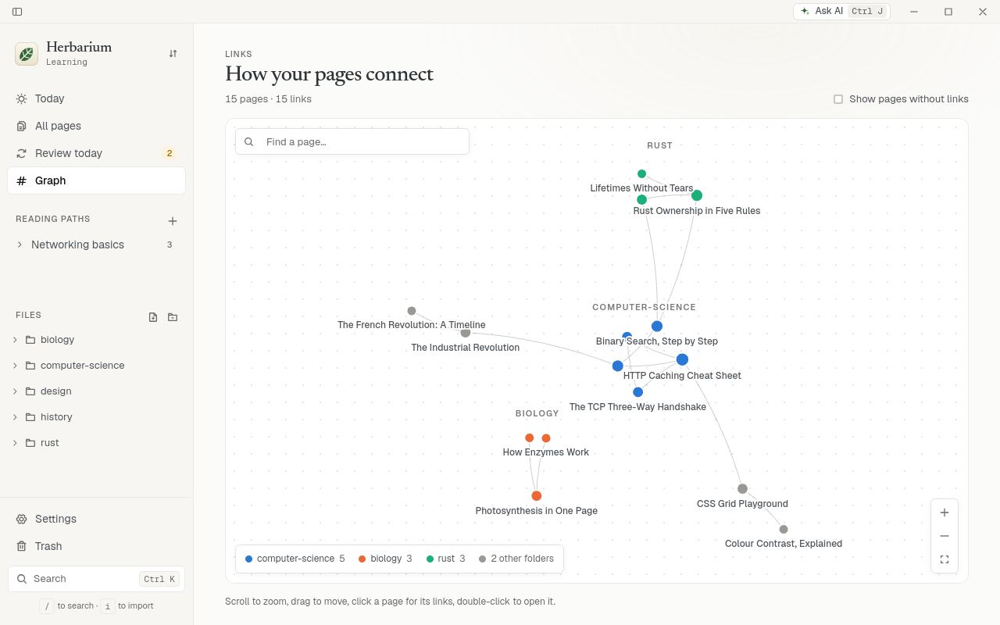
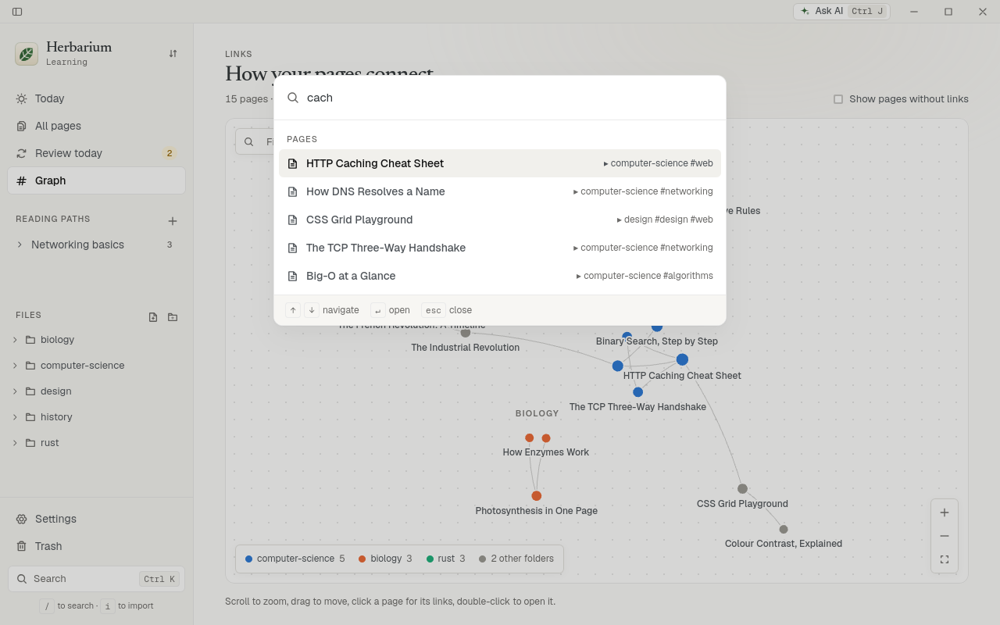

<picture>
  <source media="(prefers-color-scheme: dark)" srcset="docs/brand/icon-dark.svg">
  
</picture>

# Herbarium

[](https://github.com/abdoufermat5/herbarium/actions/workflows/ci.yml)
[](https://github.com/abdoufermat5/herbarium/actions/workflows/release.yml)
[](https://github.com/abdoufermat5/herbarium/releases/latest)
[](https://github.com/abdoufermat5/herbarium/releases)
[](LICENSE)

A desktop reader for the HTML pages AI tools generate. Save a page, find it later, open it with its interactivity intact, and schedule it for review so it comes back when you need it.

Your pages stay plain `.html` files in a folder you own.


| Today | Library | Reading a page |
| --- | --- | --- |
| <picture><source media="(prefers-color-scheme: dark)" srcset="docs/screenshots/dark-today.png"></picture> | <picture><source media="(prefers-color-scheme: dark)" srcset="docs/screenshots/dark-library.png"></picture> | <picture><source media="(prefers-color-scheme: dark)" srcset="docs/screenshots/dark-reader.png"></picture> |
| **Review** | **Graph** | **Command palette** |
| <picture><source media="(prefers-color-scheme: dark)" srcset="docs/screenshots/dark-review.png"></picture> | <picture><source media="(prefers-color-scheme: dark)" srcset="docs/screenshots/dark-graph.png"></picture> | <picture><source media="(prefers-color-scheme: dark)" srcset="docs/screenshots/dark-palette.png"></picture> |

## Install

Linux (x86_64 and arm64):

```bash
curl -fsSL https://raw.githubusercontent.com/abdoufermat5/herbarium/main/install.sh | sh
```

Installs the `.deb` on Debian/Ubuntu (asks for `sudo`), the AppImage elsewhere. Pipe to `sh -s -- --appimage` instead to skip `sudo`, or `sh -s -- --uninstall` to remove it.

Or from the [Snap Store](https://snapcraft.io/herbarium) (x86_64): `sudo snap install herbarium`. The snap updates itself and can only open vaults in your home folder or on removable media.

macOS and Windows: download from the [releases page](https://github.com/abdoufermat5/herbarium/releases/latest). These builds are not code-signed yet, so on first launch allow it in System Settings → Privacy & Security (macOS) or choose "More info → Run anyway" (Windows).

## Features

- **Import** by drag and drop, file picker, paste, or `herbarium add <file|-|url>` from a terminal, and bring in every artifact from a **Claude or ChatGPT data export** (`herbarium import <export>`).
- **Save from the browser**: the extension finds the artifacts in a Claude, ChatGPT or Gemini conversation and saves them in one click, saves any page or selection, shows when a page is already saved, and searches your vault from the address bar (`h` + space). Load it from Settings → Browser.
- **Quick capture**: a global shortcut saves the clipboard as a page, and new HTML files in Downloads are offered for saving.
- **Today**: what is due, the path you are reading, recent pages and one to rediscover; sample pages give a short tour on first launch.
- **Search** titles, tags, notes and page text, with filters.
- **Organize** with folders, tags and notes; move or edit many pages at once.
- **Read** each page in a sandboxed viewer, scripts included. Pages that save progress with `localStorage` or `window.storage` keep it between visits.
- **Edit** the HTML in the app or in your own editor. Every in-app or agent edit keeps the previous version, which you can compare and restore.
- **Review** pages with adaptive scheduling (FSRS): grade each review Again, Hard, Good or Easy and pick the retention you want, with reminders and a keyboard-driven review session.
- **Quiz** yourself: answers a page marks with `data-herbarium-recall` stay hidden until you reveal them.
- **Highlight** passages in a page and write notes in the margin; they are searchable and come back during review.
- **Ask AI** (`Ctrl/⌘ J`), one panel for everything AI: remix the page you are reading (simplify it, explain it deeper, add quiz questions, translate it, turn it into a cheat sheet, or say what you want), then compare the result and accept it; or let it sort your library into folders and tags, which you review before anything moves. Works with Claude (API key or Claude Code), OpenAI, Gemini, DeepSeek, Mistral, OpenRouter, a local Ollama or any OpenAI-compatible service (`herbarium remix`).
- **Share** a page as a secret gist or on your own GitHub Pages site, or copy a share card to paste anywhere (`herbarium publish`).
- **See** your library as a graph of links, with page previews, icons and colours for pages, folders and tags, and a health check that explains why a page does not work.
- **Remember the source**: the page, tool and prompt each page came from.
- **Link** pages to each other and see backlinks; group them into **reading paths** you step through like a course.
- **Save searches** with filters such as `tag:rust is:due updated:7d`.
- **Export** a page as one self-contained HTML file, or publish a folder as a static website.
- **Trash** with restore and undo.
- **Command palette** (`Ctrl/⌘ K`); press `?` for all shortcuts.
- Light and dark themes, English and French.

## Your vault

A vault is an ordinary folder. Each page is an `.html` file with a `.json` file next to it for its title, tags, note, highlights, review dates and saved page state. Folders are real directories; earlier versions of edited pages are kept in `.herbarium/history/`. Back it up, sync it or edit it with any tool; Herbarium picks up changes when you come back to the window.

## Safety

Generated HTML runs code, so every page is treated as untrusted. It runs in a sandbox that cannot reach your files, the app or other pages, and it cannot navigate away; links open in your browser only after you confirm.

Pages saved from the browser start with network access off, with their images and styles inlined. API keys and the GitHub token stay in a file only you can read and are sent only to the service they belong to; nothing is published without your confirmation.

Network access is a per-page switch. When on, a page can load scripts and fonts from well-known CDNs and images from any website, which means it can tell its author when you open it. Keep it off for pages you don't trust.

## Use with AI agents

Herbarium is also an [MCP](https://modelcontextprotocol.io) server, so agents can save, search, organize and schedule pages. In Claude Code:

```bash
claude mcp add herbarium -- herbarium mcp
```

Then ask, for example, *"write a short HTML explainer of Cargo workspaces and save it to Herbarium under `rust`"*. It uses the vault last opened in the app (or `--vault <path>`).

Pages are also MCP resources (`herbarium://page/<id>`), and the server offers `save_page`, `ask_vault` and `review_session` prompts. To approve agent rewrites before they land, turn on Settings → Agents → Review agent edits.

Pages open from links like `herbarium-app://open/<page-id>`, which `herbarium add` prints and agents can hand you.

## Development

Needs [Node.js](https://nodejs.org), [pnpm](https://pnpm.io), [Rust](https://rustup.rs) and the [Tauri prerequisites](https://tauri.app/start/prerequisites/).

```bash
pnpm install
pnpm tauri dev    # run the app
make ci           # everything CI checks
pnpm test:e2e     # end-to-end suites (see e2e/)
```

The end-to-end suites run the `herbarium` binary, the browser extension in Playwright's Chromium, and the desktop app through [tauri-driver](https://v2.tauri.app/develop/tests/webdriver/) on a virtual display. The desktop suite needs Linux with `webkit2gtk-driver`, `xvfb` and `cargo install tauri-driver`, and is skipped without them. `E2E_SCREENSHOTS=<folder>` keeps screenshots of the key moments.

The logo lives in [`docs/brand/`](docs/brand) as SVG, in a light and a dark version. `pnpm icons` renders every app, tray and extension icon from it; `node e2e/tools/screenshots.mjs` retakes the screenshots in `docs/screenshots/` (same requirements as the desktop suite).

Built with Tauri 2, Rust, SQLite and Svelte 5.

### Releasing

Write the changes under `[Unreleased]` in `CHANGELOG.md`, then:

```bash
pnpm release patch   # or minor | major | x.y.z
git push --follow-tags
```

The tag builds every platform and publishes the release. In-app updates need the signing key pair on the repository: the `HERBARIUM_UPDATER_PUBLIC_KEY` variable and the `TAURI_SIGNING_PRIVATE_KEY` secret (create them with `pnpm tauri signer generate`).

Optional channels — Windows code signing, WinGet, Snap and Flatpak — and the repository secrets that turn them on are documented in [`docs/distribution.md`](docs/distribution.md).

## License

[MIT](LICENSE)
