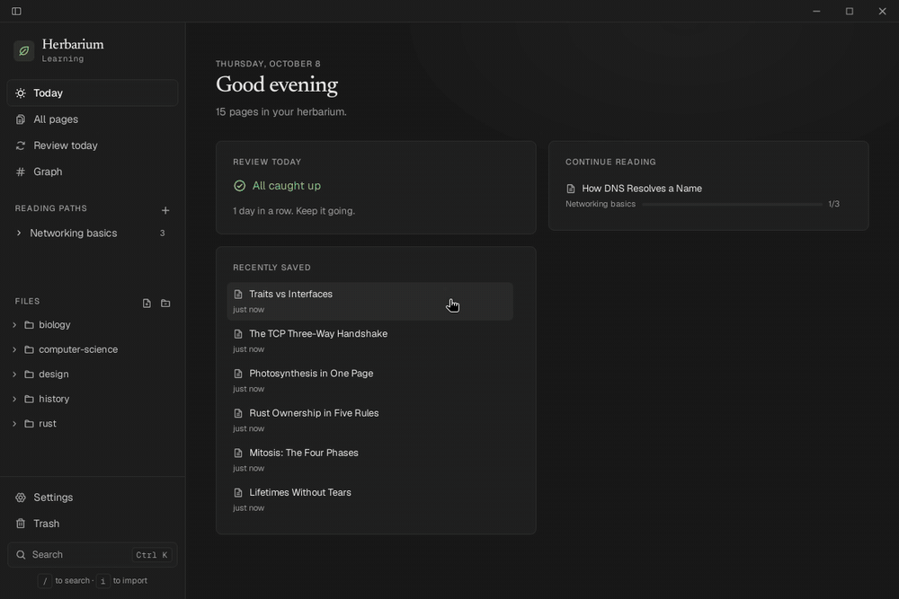

# Herbarium

[](https://github.com/abdoufermat5/herbarium/actions/workflows/ci.yml)
[](https://github.com/abdoufermat5/herbarium/actions/workflows/release.yml)
[](https://github.com/abdoufermat5/herbarium/releases/latest)
[](https://github.com/abdoufermat5/herbarium/releases)
[](LICENSE)

A desktop reader for the HTML pages AI tools generate. Save a page, find it later, open it with its interactivity intact, and schedule it for review so it comes back when you need it.

Your pages stay plain `.html` files in a folder you own.



## Install

Linux (x86_64 and arm64):

```bash
curl -fsSL https://raw.githubusercontent.com/abdoufermat5/herbarium/main/install.sh | sh
```

Installs the `.deb` on Debian/Ubuntu (asks for `sudo`), the AppImage elsewhere. Pipe to `sh -s -- --appimage` instead to skip `sudo`, or `sh -s -- --uninstall` to remove it.

Or from the [Snap Store](https://snapcraft.io/herbarium) (x86_64): `sudo snap install herbarium`. The snap updates itself and can only open vaults in your home folder or on removable media.

macOS and Windows: download from the [releases page](https://github.com/abdoufermat5/herbarium/releases/latest). These builds are not code-signed yet, so on first launch allow it in System Settings → Privacy & Security (macOS) or choose "More info → Run anyway" (Windows).

## Features

- **Import** by drag and drop, file picker, paste, or `herbarium add <file|-|url>` from a terminal.
- **Search** titles, tags, notes and page text.
- **Organize** with folders, tags and notes; move or edit many pages at once.
- **Read** each page in a sandboxed viewer, scripts included. Pages that save progress with `localStorage` or `window.storage` keep it between visits.
- **Edit** the HTML in the app or in your own editor. Every in-app or agent edit keeps the previous version, which you can compare and restore.
- **Review** pages with adaptive scheduling (FSRS): grade each review Again, Hard, Good or Easy and pick the retention you want, with reminders and a keyboard-driven review session.
- **Trash** with restore and undo.
- **Command palette** (`Ctrl/⌘ K`); press `?` for all shortcuts.
- Light and dark themes, English and French.

## Your vault

A vault is an ordinary folder. Each page is an `.html` file with a `.json` file next to it for its title, tags, note, review dates and saved page state. Folders are real directories; earlier versions of edited pages are kept in `.herbarium/history/`. Back it up, sync it or edit it with any tool; Herbarium picks up changes when you come back to the window.

## Safety

Generated HTML runs code, so every page is treated as untrusted. It runs in a sandbox that cannot reach your files, the app or other pages, and it cannot navigate away; links open in your browser only after you confirm.

Network access is a per-page switch. When on, a page can load scripts and fonts from well-known CDNs and images from any website, which means it can tell its author when you open it. Keep it off for pages you don't trust.

## Use with AI agents

Herbarium is also an [MCP](https://modelcontextprotocol.io) server, so agents can save, search, organize and schedule pages. In Claude Code:

```bash
claude mcp add herbarium -- herbarium mcp
```

Then ask, for example, *"write a short HTML explainer of Cargo workspaces and save it to Herbarium under `rust`"*. It uses the vault last opened in the app (or `--vault <path>`).

Pages open from links like `herbarium-app://open/<page-id>`, which `herbarium add` prints and agents can hand you.

## Development

Needs [Node.js](https://nodejs.org), [pnpm](https://pnpm.io), [Rust](https://rustup.rs) and the [Tauri prerequisites](https://tauri.app/start/prerequisites/).

```bash
pnpm install
pnpm tauri dev    # run the app
make ci           # everything CI checks
```

Built with Tauri 2, Rust, SQLite and Svelte 5.

### Releasing

Write the changes under `[Unreleased]` in `CHANGELOG.md`, then:

```bash
pnpm release patch   # or minor | major | x.y.z
git push --follow-tags
```

The tag builds every platform and publishes the release. In-app updates need the signing key pair on the repository: the `HERBARIUM_UPDATER_PUBLIC_KEY` variable and the `TAURI_SIGNING_PRIVATE_KEY` secret (create them with `pnpm tauri signer generate`).

Optional channels — Windows code signing, WinGet, Snap and Flatpak — and the repository secrets that turn them on are documented in [`docs/distribution.md`](docs/distribution.md).

## License

[MIT](LICENSE)
